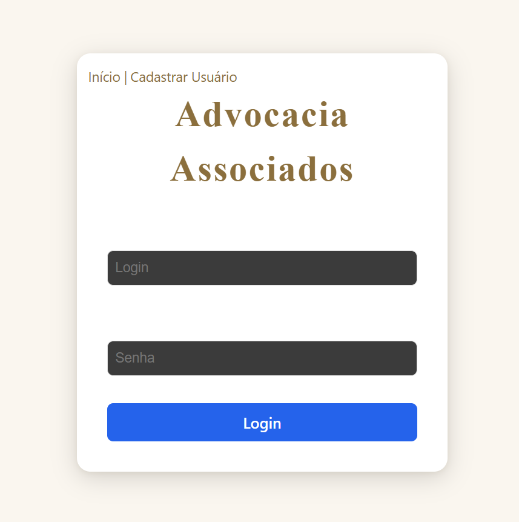

<h1 align="center" style="font-weight: bold;"> Página de Login em React 💻</h1>


<p align="center">
 <a href="#about">Sobre</a> • 
 <a href="#started">Iniciando</a> • 
  <a href="#routes">Rotas</a> •  
</p>


<p align="center">
    
</p>

<h2 id="about">📌 Sobre</h2>

Este projeto foi criado para ser usado como frontend da aplicação https://github.com/convisolabs/java-vuln-api.

<h2 id="started">🚀 Iniciando</h2>

O projeto roda apenas localmente, conforme especificações abaixo:

<h3>Requisitos</h3>

Segue lista de requisitos necessários para rodar o projeto:

- [NodeJS](https://nodejs.org/en)
- [Backend Java](https://github.com/convisolabs/java-vuln-app)
- [React](https://react.dev/)

<h3>Clonando</h3>

Como clonar o projeto
```bash
git clone https://github.com/luzivangois/advocacia-react.git
```

<h3>Subindo a aplicação</h3>

Como subir localmente a sua aplicação

```bash
cd project-name
npm install
npm run dev
```
A aplicação irá subir no seguinte endereço:
> http://localhost:5173/
